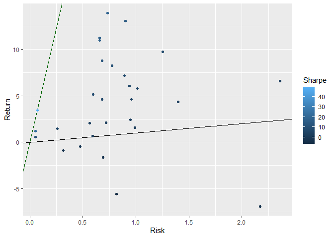
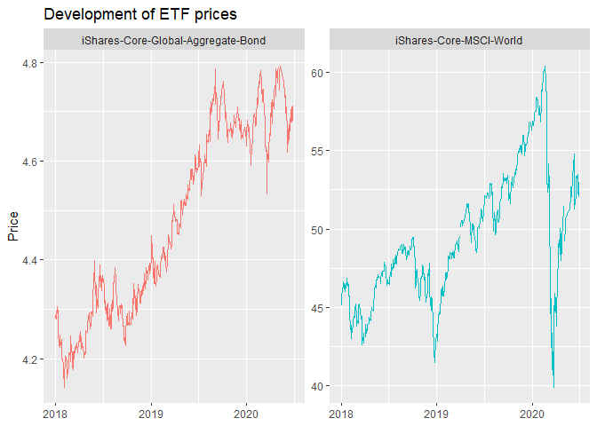
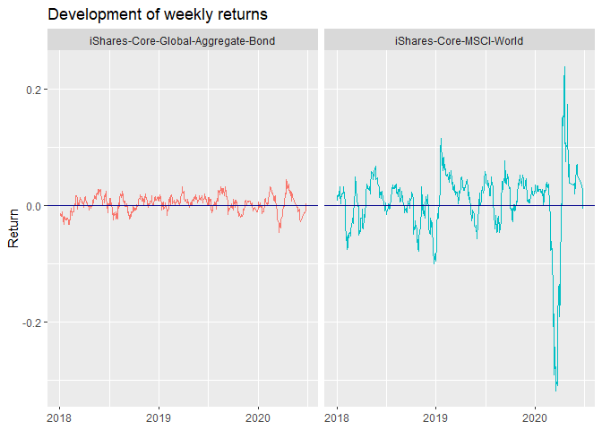
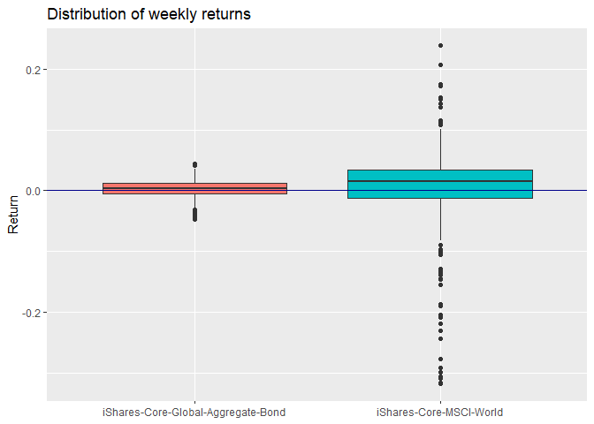

iShares
================

# Table of contents

  - [1\. Basic idea](#1-basic-idea)
  - [2\. Download and extract data](#2-download-and-extract-data)
    - [2.a Get XML data](#2a-get-xml-data)
    - [2.b Extract sheet “Overview”](#2b-extract-sheet-overview)
    - [2.c Extract sheet “Historic”](#2c-extract-sheet-historic)
    - [2.d Extract sheet “Dividends”](#2d-extract-sheet-dividends)
    - [2.e Clean download data](#2e-clean-download-data)
    - [2.f Complete function for ishares download](#2f-complete-function-for-ishares-download)
  - [3\. Aggregate data and convert to Euro returns](#3-aggregate-data-and-convert-to-euro-returns)
    - [3.a Get exchange rates](#3a-get-exchange-rates)
    - [3.b Aggregate data and convert to Euro returns](#3b-aggregate-data-and-convert-to-euro-returns)
  - [4\. Analyze historic ETF performance](#4-analyze-historic-etf-performance)
    - [4.a Compute trailing monthly returns](#4a-compute-trailing-monthly-returns)
    - [4.b Compute key metrics](#4b-compute-key-metrics)

# 1\. Basic idea

[Get to Top](#table-of-contents)

The basic idea of this script is download information on ETFs that are
part of the iShares family, published by Blackrock. Blackrock provides
basic information on for each ETF on the respective fund’s website. The
aim of this code is to:

  - Download and extract data for a number of ETFs
  - Aggregate data and convert to Euro returns
  - Analyze historic ETF performance

The code uses the following `R` packages:

``` r
library(knitr)
library(lubridate)
library(progress)
library(tidyverse)
library(xml2)
```

# 2\. Download and extract data

[Get to Top](#table-of-contents)

Blackrock shows detailed information on its various iShares ETFs on the
ETF’s website (e.g. [iShares Core € Corp Bond UCITS
ETF](https://www.ishares.com/de/privatanleger/de/produkte/251726/ishares-euro-corporate-bond-ucits-etf/)).
For each ETF, Blackrock provides an Excel file for download covering
fundamental information, historic prices, positions, and dividends. I
limit the analysis to [iShare’s most popular standard and ESG
ETFs](https://www.ishares.com/de/privatanleger/de/anlegen/bestseller). A
list of ETF names and URLs to the respective Excel file is the basis for
the analysis:

    ## # A tibble: 6 x 2
    ##   name                   url                                                    
    ##   <chr>                  <chr>                                                  
    ## 1 DivDAX                 https://www.blackrock.com/at/individual/produkte/25176~
    ## 2 iShares-Core-Corp-Bond https://www.ishares.com/de/privatanleger/de/produkte/2~
    ## 3 Dow-Jones-Global-Tita~ https://www.ishares.com/de/privatanleger/de/produkte/2~
    ## 4 iShares-Core-DAX       https://www.ishares.com/de/privatanleger/de/produkte/2~
    ## 5 Dow-Jones-US-Select-D~ https://www.ishares.com/de/privatanleger/de/produkte/2~
    ## 6 iShares-Core-FTSE-100  https://www.ishares.com/de/privatanleger/de/produkte/2~

## 2.a Get XML data

[Get to Top](#table-of-contents)

The Excel files provided by iShares are not “real” Excel files but are
instead XML files created in Excel. The first step is therefore to
download the XML file from iShares, fix some encoding issues in the
first line for for the character *&*.

``` r
get_xml <- function(etf_url) {
  file_raw <- tempfile()
  file_xml <- tempfile()
  download.file(etf_url, file_raw)
  txt <- readLines(file_raw, encoding = "UTF-8-BOM")
  txt[1] <- "<?xml version=\"1.0\"?>"
  txt <- str_replace_all(txt, "S&P", "SP")
  write_lines(txt, file_xml)
  out <- read_xml(file_xml)
  return(out)
}
```

The output from the `get_xml` function is an XML file with 6 nodes:

    ## {xml_document}
    ## <Workbook xmlns:ss="urn:schemas-microsoft-com:office:spreadsheet">
    ## [1] <ss:Styles>\n  <ss:Style ss:ID="Default">\n    <ss:Alignment ss:Horizonta ...
    ## [2] <ss:Worksheet ss:Name="&#xC3;&#x153;berblick">\n  <ss:Table>\n    <ss:Row ...
    ## [3] <ss:Worksheet ss:Name="Positionen">\n  <ss:Table>\n    <ss:Row>\n      <s ...
    ## [4] <ss:Worksheet ss:Name="Historisch">\n  <ss:Table>\n    <ss:Row>\n      <s ...
    ## [5] <ss:Worksheet ss:Name="Wertentwicklung">\n  <ss:Table>\n    <ss:Row>\n    ...
    ## [6] <ss:Worksheet ss:Name="Aussch&#xC3;&#xBC;ttungen">\n  <ss:Table>\n    <ss ...

## 2.b Extract sheet “Overview”

[Get to Top](#table-of-contents)

The XML node \#2 contains the sheet “Overview”. The following function
loops through all cells of the Excel sheet and extracts the overview
information.

``` r
extract_overview <- function(data_xml) {
  xml_overview <- data_xml %>%
    xml_child(2) %>%
    xml_child(1)
  
  cnt_rows <- xml_length(xml_overview)
  
  out_cols <- vector(mode = "character", length = 2)
  out_rows <- vector(mode = "list", length = cnt_rows - 4)
  
  pb <- progress_bar$new(total = cnt_rows, format = "[:bar] :percent")
  
  for (i in seq(5, cnt_rows)) {
    xml_row <- xml_overview %>%
      xml_child(i)
    
    out_cols[[1]] <- xml_row %>%
      xml_child(1) %>%
      xml_text()
    
    out_cols[[2]] <- xml_row %>%
      xml_child(2) %>%
      xml_text()
    
    out_rows[[i - 4]] <- out_cols
    pb$tick()
  }
  
  out <- map_dfr(out_rows, ~ tibble(parameter = .x[1], value = .x[2]))
  return(out)
}
```

The output from the `extract_overview` function is a tibble with two
columns containing the basic ETF information:

    ## # A tibble: 37 x 2
    ##    parameter                 value             
    ##    <chr>                     <chr>             
    ##  1 Basiswährung             EUR               
    ##  2 Anlageklasse              Aktien            
    ##  3 Wertpapierleiheertrag     0,00              
    ##  4 Auflagedatum              04.Apr.2005       
    ##  5 Total Expense Ratio       0,31              
    ##  6 Vergleichsindex           DivDAX®          
    ##  7 Ausschüttungshäufigkeit Bis zu 4x pro Jahr
    ##  8 Domizil                   Deutschland       
    ##  9 Methodik                  Replikation       
    ## 10 Product Structure         Physical          
    ## # ... with 27 more rows

## 2.c Extract sheet “Historic”

[Get to Top](#table-of-contents)

The XML node \#4 contains the sheet “Historic”. The following function
loops through all cells of the Excel sheet and extracts information on
historic prices. Since looping through 7 columns \* \> 1000 rows is time
consuming, the function checks whether this information has alredy been
extracted previously. It compares the number of rows of the output file
`[etf_name]_price.tsv` to the downloaded file and extracts only the rows
not contained in the output file.

``` r
extract_historic <- function(data_xml, file_price){
  xml_price <- data_xml %>%
    xml_child(4) %>%
    xml_child(1)

  if (file.exists(file_price)) {
    old_price <- read_tsv(file_price)
    cnt_rows <- min(xml_length(xml_price), xml_length(xml_price) - nrow(old_price) + 5)
  } else {
    cnt_rows <- xml_length(xml_price)
  }
  
  out_cols <- vector(mode = "character", length = 3)
  out_rows <- vector(mode = "list", length = cnt_rows - 1)
  
  pb <- progress_bar$new(total = cnt_rows - 1, format = "[:bar] :percent")
  
  for (i in seq(2, cnt_rows)) {
    xml_row <- xml_price %>%
      xml_child(i)
    
    out_cols[[1]] <- xml_row %>%
      xml_child(1) %>%
      xml_text()
    
    out_cols[[2]] <- xml_row %>%
      xml_child(2) %>%
      xml_text()
    
    out_cols[[3]] <- xml_row %>%
      xml_child(3) %>%
      xml_text()
    
    out_rows[[i - 1]] <- out_cols
    pb$tick()
  }
  
  out <- map_dfr(out_rows, ~ tibble(date = .x[1], currency = .x[2], price = .x[3]))
  return(out)
}
```

The output from the `extract_price` function is a tibble with three
columns containing historic ETF information (date, currency, price \~
NAV):

    ## # A tibble: 14 x 3
    ##    date        currency price  
    ##    <chr>       <chr>    <chr>  
    ##  1 25.Jun.2020 EUR      15.9902
    ##  2 24.Jun.2020 EUR      15.8887
    ##  3 19.Jun.2020 EUR      16.1201
    ##  4 18.Jun.2020 EUR      16.0815
    ##  5 17.Jun.2020 EUR      16.0786
    ##  6 16.Jun.2020 EUR      16.0368
    ##  7 15.Jun.2020 EUR      15.5504
    ##  8 12.Jun.2020 EUR      15.5913
    ##  9 11.Jun.2020 EUR      15.5563
    ## 10 10.Jun.2020 EUR      16.3873
    ## 11 09.Jun.2020 EUR      16.5336
    ## 12 08.Jun.2020 EUR      16.8603
    ## 13 05.Jun.2020 EUR      16.7734
    ## 14 04.Jun.2020 EUR      16.1843

## 2.d Extract sheet “Dividends”

[Get to Top](#table-of-contents)

The XML node \#6 (if included in the XML file) contains the sheet
“Dividends”. The following function loops through all cells of the
Excel sheet and extracts information on dividends. Like for the sheet
“Historic”, looping through all cells can be time consuming. Again,
the function checks whether this information has alredy been extracted
previously and compares the number of rows of the output file
`[etf_name]_dividends.tsv` to the downloaded file and extracts only the
rows not contained in the output file.

``` r
extract_dividends <- function(data_xml, file_dividends){
  if (xml_length(data_xml) == 6) {
    xml_dividends <- data_xml %>%
      xml_child(6) %>%
      xml_child(1)
    
    if (file.exists(file_dividends)) {
      old_dividends <- read_tsv(file_dividends)
      cnt_rows <- min(xml_length(xml_dividends), xml_length(xml_dividends) - nrow(old_dividends) + 5)
    } else {
      cnt_rows <- xml_length(xml_dividends)
    }
    
    out_cols <- vector(mode = "character", length = 2)
    out_rows <- vector(mode = "list", length = cnt_rows - 1)
    
    pb <- progress_bar$new(total = cnt_rows - 1, format = "[:bar] :percent")
    
    for (i in seq(2, cnt_rows)) {
      xml_row <- xml_dividends %>%
        xml_child(i)
      
      out_cols[[1]] <- xml_row %>%
        xml_child(1) %>%
        xml_text()
      
      out_cols[[2]] <- xml_row %>%
        xml_child(4) %>%
        xml_text()
      
      out_rows[[i - 1]] <- out_cols
      pb$tick()
    }
    
    out <- map_dfr(out_rows, ~ tibble(date = .x[1], dividend = .x[2]))
  } else {
    out <- tibble(date = NA, dividend = NA)
  }
  return(out)
}
```

The output from the `extract_dividends` function is a tibble with two
columns containing ETF dividends (date, dividend):

    ## # A tibble: 34 x 2
    ##    date         dividend
    ##    <chr>        <chr>   
    ##  1 25.Mär.2020 0       
    ##  2 27.Dez.2019  0       
    ##  3 24.Sep.2019  0       
    ##  4 24.Jun.2019  0.422498
    ##  5 25.Mär.2019 0       
    ##  6 28.Dez.2018  0       
    ##  7 26.Sep.2018  0       
    ##  8 26.Jun.2018  0.414135
    ##  9 08.Jän.2018 0       
    ## 10 02.Jän.2018 0       
    ## # ... with 24 more rows

## 2.e Clean download data

[Get to Top](#table-of-contents)

The next step after the download is to clean the data. The data cleaning
basically consists of changing some special characters and converting
character columns to numeric and date. The results are saved as:

  - `[etf_name]_overview.tsv`
  - `[etf_name]_prices.tsv`
  - `[etf_name]_dividends.tsv`

<!-- end list -->

``` r
clean_overview <- function(data_overview, file_overview) {
  data_overview <- data_overview %>%
    mutate(parameter = str_replace_all(parameter, "\u00C3\u00a4", "\u00e4"))%>%
    mutate(parameter = str_replace_all(parameter, "\u00C3\u00b6", "\u00f6"))%>%
    mutate(parameter = str_replace_all(parameter, "\u00C3\u00bc", "\u00fc")) %>%
    mutate(parameter = str_remove_all(parameter, "\u00C3")) %>%
    mutate(value = str_replace_all(value, "\u00C3\u00a4", "\u00e4"))%>%
    mutate(value = str_replace_all(value, "\u00C3\u00b6", "\u00f6"))%>%
    mutate(value = str_replace_all(value, "\u00C3\u00bc", "\u00fc")) %>%
    mutate(value = str_remove_all(value, "\u00C3"))
  
  write_tsv(data_overview, file_overview)
}

clean_price <- function(data_price, file_price) {
  data_price <- data_price %>%
    mutate(date = str_replace_all(date, "\u00C3\u00a4", "\u00e4")) %>%
    mutate(date = str_replace(date, "Jan", "J\u00e4n")) %>%
    mutate(date = as.Date(date, format = "%d.%b.%Y")) %>%
    mutate(price = as.numeric(price))
  
  if (file.exists(file_price)) {
    data_price <- bind_rows(data_price, read_tsv(file_price)) %>%
      unique() %>%
      group_by(date) %>%
      filter(row_number() == 1) %>%
      ungroup() %>%
      arrange(desc(date))
  }
  
  write_tsv(data_price, file_price)
}
  
clean_dividends <- function(data_xml, data_dividends, file_dividends) {
  data_dividends <- data_dividends %>%
    mutate(date = str_replace_all(date, "\u00C3\u00a4", "\u00e4")) %>%
    mutate(date = str_replace(date, "Jan", "J\u00e4n")) %>%
    mutate(date = as.Date(date, format = "%d.%b.%Y")) %>%
    mutate(dividend = as.numeric(dividend)) %>%
    filter(!is.na(dividend) & dividend != 0)
  
  if (xml_length(data_xml) == 6 & file.exists(file_dividends)) {
	data_dividends <- bind_rows(data_dividends, read_tsv(file_dividends)) %>%
      unique() %>%
      group_by(date) %>%
      filter(row_number() == 1) %>%
      ungroup() %>%
      arrange(desc(date))
  }
  
  write_tsv(data_dividends, file_dividends)
}
```

## 2.f Complete function for ishares download

[Get to Top](#table-of-contents)

The complete function to download the ETF data from iShares:

``` r
download_ishares <- function(etf_name, etf_url) {
  file_overview <- file.path(dir_price, str_c(etf_name, "_overview.tsv"))
  file_price <- file.path(dir_price, str_c(etf_name, "_price.tsv"))
  file_dividends <- file.path(dir_price, str_c(etf_name, "_dividends.tsv"))
  
  data_xml <- get_xml(etf_url)
  data_overview <- extract_overview(data_xml)
  data_price <- extract_historic(data_xml, file_price)
  data_dividends <- extract_dividends(data_xml, file_dividends)
  
  clean_overview(data_overview, file_overview)
  clean_price(data_price, file_price)
  clean_dividends(data_xml, data_dividends, file_dividends)
}
```

Map the `download_ishares` function to the list of ETF names and URLs
`[data_etf]`:

``` r
map2(data_etf$name, data_etf$url, download_ishares)
```

The output are three files for each ETF that contain cleaned overview
data, historic prices, and dividends:

    ## # A tibble: 37 x 2
    ##    parameter               value             
    ##    <chr>                   <chr>             
    ##  1 Basiswährung            EUR               
    ##  2 Anlageklasse            Aktien            
    ##  3 Wertpapierleiheertrag   0,00              
    ##  4 Auflagedatum            04.Apr.2005       
    ##  5 Total Expense Ratio     0,31              
    ##  6 Vergleichsindex         DivDAX®           
    ##  7 Ausschüttungshäufigkeit Bis zu 4x pro Jahr
    ##  8 Domizil                 Deutschland       
    ##  9 Methodik                Replikation       
    ## 10 Product Structure       Physical          
    ## # ... with 27 more rows

    ## # A tibble: 3,853 x 3
    ##    date       currency price
    ##    <date>     <chr>    <dbl>
    ##  1 2020-06-19 EUR       16.1
    ##  2 2020-06-18 EUR       16.1
    ##  3 2020-06-17 EUR       16.1
    ##  4 2020-06-16 EUR       16.0
    ##  5 2020-06-15 EUR       15.6
    ##  6 2020-06-12 EUR       15.6
    ##  7 2020-06-11 EUR       15.6
    ##  8 2020-06-10 EUR       16.4
    ##  9 2020-06-09 EUR       16.5
    ## 10 2020-06-08 EUR       16.9
    ## # ... with 3,843 more rows

    ## # A tibble: 18 x 2
    ##    date       dividend
    ##    <date>        <dbl>
    ##  1 2019-06-24   0.422 
    ##  2 2018-06-26   0.414 
    ##  3 2017-06-26   0.303 
    ##  4 2016-09-26   0.0162
    ##  5 2016-06-24   0.363 
    ##  6 2016-03-29   0.0344
    ##  7 2015-06-24   0.488 
    ##  8 2014-05-30   0.422 
    ##  9 2013-05-31   0.469 
    ## 10 2012-05-31   0.498 
    ## 11 2011-05-31   0.477 
    ## 12 2010-05-31   0.433 
    ## 13 2009-05-31   0.433 
    ## 14 2008-07-15   0.609 
    ## 15 2007-07-16   0.503 
    ## 16 2006-07-17   0.344 
    ## 17 2005-07-15   0.251 
    ## 18 NA           0.0344

# 3\. Aggregate data and convert to Euro returns

[Get to Top](#table-of-contents)

The iShares ETFs use three different currencies: US Dollar, British
Pound, and Euro. Therefore, I convert prices and dividends to Euro in
order to compre the ETFs.

## 3.a Get exchange rates

[Get to Top](#table-of-contents)

For the comparison, I download exchange rates provided by the
[ECB](https://www.ecb.europa.eu/stats/policy_and_exchange_rates/euro_reference_exchange_rates/html/index.en.html).
The ECB offers a ZIP file containing various monthly Euro exchnage rates
for download.

``` r
file_zip <- tempfile()
download.file("https://www.ecb.europa.eu/stats/eurofxref/eurofxref-hist.zip", file_zip)
data_fx <- read_csv(unz(file_zip, "eurofxref-hist.csv")) %>%
  select(date = Date, usd_rate = USD, gbp_rate = GBP)
```

## 3.b Aggregate data and convert to Euro returns

[Get to Top](#table-of-contents)

I loop through the list of ETF names and URLs `[data_etf]` and load the
individual ETF files extracted and saved in section II. To account for
dividends, I add the dividend payout to the ETF price \~ net asset
value, assuming that all dividend payout was reinvested. Dividend
payouts are reduced by a capital gains tax rate of 27.5%.

``` r
ishares_data <- map(data_etf$name, ~{

  # load files
  overview <- read_tsv(file.path(dir_overview, str_c(.x, "_overview.tsv")))
  price <- read_tsv(file.path(dir_price, str_c(.x, "_price.tsv")))
  dividends <- read_tsv(file.path(dir_dividends, str_c(.x, "_dividends.tsv")))
  
  # get metadata
  name <- .x
  isin <- overview$value[overview$parameter == "ISIN"]
  
  # combine data
  out <- tibble(name, isin) %>%
    mutate(id = TRUE) %>%
    left_join(mutate(price, id = TRUE), by = "id") %>%
    select(-id)
  
  # dividends
  if(dim(dividends)[1] > 0) {
    out <- out %>%
      left_join(dividends, by = "date") %>%
      mutate(dividend = coalesce(dividend * 0.725, 0)) %>%
      mutate(dividend = cumsum(dividend))
  } else {
    out$dividend <- 0
  }
  
  out <- out %>%
    mutate(price = price + dividend) %>%
    select(-dividend)
  
  return(out)
}) %>% bind_rows() %>%
  filter(!is.na(date))
```

The code above results in a table with five columns (name, isin, date,
currency, price) containing the aggregated data for all ETFs:

    ## # A tibble: 95,208 x 5
    ##    name   isin         date       currency price
    ##    <chr>  <chr>        <date>     <chr>    <dbl>
    ##  1 DivDAX DE0002635273 2020-06-19 EUR       16.1
    ##  2 DivDAX DE0002635273 2020-06-18 EUR       16.1
    ##  3 DivDAX DE0002635273 2020-06-17 EUR       16.1
    ##  4 DivDAX DE0002635273 2020-06-16 EUR       16.0
    ##  5 DivDAX DE0002635273 2020-06-15 EUR       15.6
    ##  6 DivDAX DE0002635273 2020-06-12 EUR       15.6
    ##  7 DivDAX DE0002635273 2020-06-11 EUR       15.6
    ##  8 DivDAX DE0002635273 2020-06-10 EUR       16.4
    ##  9 DivDAX DE0002635273 2020-06-09 EUR       16.5
    ## 10 DivDAX DE0002635273 2020-06-08 EUR       16.9
    ## # ... with 95,198 more rows

Next, I convert all ETF prices that are not Euro denomminated to Euro
using the exchange rates downloaded from the ECB.

``` r
ishares_data <- ishares_data %>%
  left_join(data_fx, by = "date") %>%
  mutate(price = case_when(currency == "USD" ~ price / usd_rate,
                           currency == "GBP" ~ price / gbp_rate,
                           TRUE ~ price)) %>%
  select(-currency, -usd_rate, -gbp_rate)
```

The result is a long-formatted dataframe of Euro-denomminated ETF prices
for various dates:

    ## # A tibble: 95,208 x 4
    ##    name   isin         date       price
    ##    <chr>  <chr>        <date>     <dbl>
    ##  1 DivDAX DE0002635273 2020-06-19  16.1
    ##  2 DivDAX DE0002635273 2020-06-18  16.1
    ##  3 DivDAX DE0002635273 2020-06-17  16.1
    ##  4 DivDAX DE0002635273 2020-06-16  16.0
    ##  5 DivDAX DE0002635273 2020-06-15  15.6
    ##  6 DivDAX DE0002635273 2020-06-12  15.6
    ##  7 DivDAX DE0002635273 2020-06-11  15.6
    ##  8 DivDAX DE0002635273 2020-06-10  16.4
    ##  9 DivDAX DE0002635273 2020-06-09  16.5
    ## 10 DivDAX DE0002635273 2020-06-08  16.9
    ## # ... with 95,198 more rows

# 4\. Analyze historic ETF performance

[Get to Top](#table-of-contents)

For a comparison of the ETFs, I analyze their historic performance,
using trailling monthly returns. I rely on the following key metrics:

  - Average returns
  - Variance of returns
  - Sharpe ratio
  - Share of months with positive returns

## 4.a Compute trailing monthly returns

[Get to Top](#table-of-contents)

The first step is to map the ETF price data to a list of all possible
dates and to categorize these dates into 28 groups. Each group is one of
28 possible monthly return series. Adding all 28 groups, gives a set of
trailing monthly returns for each ETF.

``` r
dates <- tibble(date = seq(from = min(ishares_data$date), to = max(ishares_data$date), by = 1))
dates$i <- rep(1:28, ceiling(nrow(dates) / 28))[seq(nrow(dates))]

data_returns <- map(unique(ishares_data$name), ~{
  xprices <- ishares_data %>%
    filter(name == .x) %>%
    right_join(dates, by = "date") %>%
    fill(name) %>%
    filter(!is.na(name))
  
  xreturns <- map(1:28, ~{
    out <- xprices %>%
      filter(i == .x) %>%
      mutate(start_px = lag(price)) %>%
      mutate(diff_px = price - start_px) %>%
      mutate(return = diff_px / start_px) %>%
      select(isin, name, date, return)
    return(out)
  }) %>%
    bind_rows() %>%
    arrange(date) %>%
    filter(!is.na(return))
  return(xreturns)
}) %>%   bind_rows()
```

    ## # A tibble: 91,505 x 4
    ##    isin         name   date         return
    ##    <chr>        <chr>  <date>        <dbl>
    ##  1 DE0002635273 DivDAX 2005-05-02 -0.0127 
    ##  2 DE0002635273 DivDAX 2005-05-03 -0.0201 
    ##  3 DE0002635273 DivDAX 2005-05-04 -0.0213 
    ##  4 DE0002635273 DivDAX 2005-05-05 -0.0158 
    ##  5 DE0002635273 DivDAX 2005-05-06 -0.0173 
    ##  6 DE0002635273 DivDAX 2005-05-09 -0.0163 
    ##  7 DE0002635273 DivDAX 2005-05-10 -0.0201 
    ##  8 DE0002635273 DivDAX 2005-05-11 -0.0179 
    ##  9 DE0002635273 DivDAX 2005-05-12 -0.0192 
    ## 10 DE0002635273 DivDAX 2005-05-13 -0.00950
    ## # ... with 91,495 more rows

## 4.b Compute key metrics

[Get to Top](#table-of-contents)

**Average returns, variance, & Sharpe ratio**

``` r
kpi <- data_returns %>%
  group_by(isin, name) %>%
  summarise(risk = var(return),
            returns = mean(return)) %>%
  ungroup() %>%
  mutate(sharpe = (returns / risk) * sqrt(365 / 28)) %>%
  mutate(risk = risk * sqrt(365 / 28) * 100,
        returns = returns * (365 / 28) * 100)

kpi %>%
  arrange(desc(sharpe)) %>%
  select(ISIN = isin, Name = name, Return = returns, Risk = risk, Sharpe = sharpe) %>%
  head(10) %>%
  kable(digits = 2)
```

| ISIN         | Name                                    | Return | Risk | Sharpe |
| :----------- | :-------------------------------------- | -----: | ---: | -----: |
| IE00B3F81409 | iShares-Core-Global-Aggregate-Bond      |   3.44 | 0.07 |  49.51 |
| IE00B4WXJJ64 | iShares-Core-Govt-Bond                  |   1.20 | 0.05 |  22.58 |
| IE00B5BMR087 | iShares-Core-SP-500                     |  13.85 | 0.73 |  18.87 |
| IE00B4L5Y983 | iShares-Core-MSCI-World                 |  11.19 | 0.66 |  16.98 |
| IE00B6R52259 | iShares-MSCI-ACWI                       |  10.91 | 0.66 |  16.59 |
| DE000A0F5UF5 | NASDAQ                                  |  12.99 | 0.90 |  14.45 |
| IE00B57X3V84 | iShares-Dow-Jones-Global-Sustainability |   8.77 | 0.68 |  12.86 |
| IE00B3F81R35 | iShares-Core-Corp-Bond                  |   0.56 | 0.05 |  10.90 |
| IE00B4L5YX21 | iShares-Core-MSCI-Japan                 |   8.20 | 0.78 |  10.58 |
| IE00B4ND3602 | iShares-Physical-Gold                   |   5.13 | 0.60 |   8.57 |

``` r
kpi %>%
  select(Return = returns, Risk = risk, Sharpe = sharpe) %>%
  ggplot() +
  geom_abline(aes(intercept = 0, slope = 1)) +
  geom_abline(aes(intercept = 0, slope = max(kpi$sharpe)), colour = "darkgreen") +
  geom_point(aes(x = Risk, y = Return, colour = Sharpe))
```

<!-- -->

**Share of months with positive returns**

``` r
data_returns %>%
  mutate(return = return > 0) %>%
  group_by(isin, name) %>%
  summarise(week_pos = sum(return),
            week_tot = n()) %>%
  mutate(share_pos = week_pos / week_tot * 100) %>%
  arrange(desc(share_pos)) %>%
  select(ISIN = isin, Name = name, Share_Positives = share_pos, Weeks_Positive = week_pos, Weeks_Total = week_tot) %>%
  head(10) %>%
  kable(digits = 2)
```

| ISIN         | Name                                    | Share\_Positives | Weeks\_Positive | Weeks\_Total |
| :----------- | :-------------------------------------- | ---------------: | --------------: | -----------: |
| IE00B6R52259 | iShares-MSCI-ACWI                       |            63.38 |            1329 |         2097 |
| IE00B5BMR087 | iShares-Core-SP-500                     |            63.28 |            1551 |         2451 |
| IE00B4L5Y983 | iShares-Core-MSCI-World                 |            62.68 |            1646 |         2626 |
| DE0005933923 | MDAX                                    |            62.49 |            2935 |         4697 |
| DE000A0F5UF5 | NASDAQ                                  |            62.48 |            2155 |         3449 |
| IE00B3F81409 | iShares-Core-Global-Aggregate-Bond      |            62.01 |             364 |          587 |
| IE00B57X3V84 | iShares-Dow-Jones-Global-Sustainability |            61.38 |            1389 |         2263 |
| IE00B52MJY50 | iShares-Core-MSCI-Pacific-ex-Japan      |            60.72 |            1546 |         2546 |
| DE0005933972 | TecDax                                  |            59.70 |            2807 |         4702 |
| IE00BKM4GZ66 | iShares-Core-MSCI-EM                    |            59.60 |             866 |         1453 |

**Plot ETF returns**

``` r
ishares_data %>%
  filter(isin %in% c("IE00B3F81409", "IE00B4L5Y983") & year(date) >= 2018) %>%
  select(Name = name, Date = date, Price = price) %>%
  ggplot() +
  geom_line(aes(x = Date, y = Price, colour = Name)) +
  facet_wrap(~ Name, scales = "free_y") +
  guides(colour = FALSE) +
  labs(title = "Development of ETF prices", x = NULL)
```

<!-- -->

``` r
data_returns %>%
  filter(isin %in% c("IE00B3F81409", "IE00B4L5Y983") & year(date) >= 2018) %>%
  select(Name = name, Date = date, Return = return) %>%
  ggplot() +
  geom_line(aes(x = Date, y = Return, colour = Name)) +
  geom_hline(aes(yintercept = 0), colour = "darkblue") +
  facet_wrap(~ Name) +
  guides(colour = FALSE) +
  labs(title = "Development of weekly returns", x = NULL)
```

<!-- -->

``` r
data_returns %>%
  filter(isin %in% c("IE00B3F81409", "IE00B4L5Y983") & year(date) >= 2018) %>%
  select(Name = name, Return = return) %>%
  ggplot() +
  geom_boxplot(aes(x = Name, y = Return, fill = Name)) +
  geom_hline(aes(yintercept = 0), colour = "darkblue") +
  guides(fill = FALSE) +
  labs(title = "Distribution of weekly returns", x = NULL)
```

<!-- -->

These results allow the selection of the best performing iShares ETF for
investment or can be used for further portfolio analysis.

[Get to Top](#table-of-contents)
